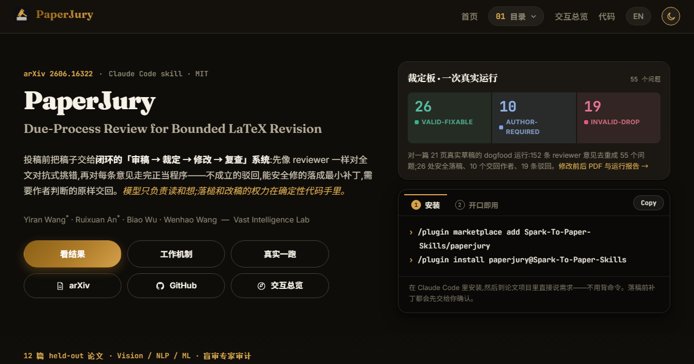

**中文** · [English](README.en.md)

<p align="center">
  
</p>

<h1 align="center">PaperJury</h1>

<p align="center">投稿前，先让 AI 陪审团审一遍。</p>

<p align="center">
  <a href="https://u7079256.github.io/paperjury/paperjury-paper.pdf"></a>
  <a href="https://u7079256.github.io/paperjury/overview.html?lang=zh"></a>
  <a href="https://github.com/u7079256/paperjury/stargazers"></a>
  <a href="https://github.com/u7079256/paperjury/releases"></a>
  
</p>

<p align="center">
  <a href="https://u7079256.github.io/paperjury/overview.html?lang=zh"></a>
</p>

论文写完后，最容易漏掉的往往不是语法，而是 reviewer 会抓住的论证缝隙：claim 够不够稳，实验是否真正支撑结论，格式上有没有可能先被 desk-reject。直接问 AI「我论文怎么样」，常常只会得到礼貌夸奖，或者一堆不分轻重的挑刺。

**PaperJury 是 Claude Code skill**，把投稿前自查做成一套闭环：**审稿 → 裁定 → 修改 → 复查**。它不会照单全收 AI 反馈，而是先把每条意见分成三类：

| 结果 | 含义 |
|---|---|
| **安全修复** | 表达不清、claim 过强、结构不顺这类文本层面的问题；不需要新实验，也不会让论断漂移。 |
| **作者处理** | 缺实验、缺 ablation、缺数据或证据，必须由作者判断。 |
| **不成立** | AI 评审误读了论文，或者提出了不该改的问题。 |

> [!IMPORTANT]
> PaperJury 是投稿前的自查流程，**不替代作者的科学判断，也不替代 peer review**。它不能拿来编造实验、伪造结果、加上没有证据支撑的 claim，或者掩盖论文局限。遇到需要新实验、缺失证据、作者私有知识或研究层面判断的问题，它都会交回作者处理。

---

## 目录

- [快速上手](#快速上手)
- [能帮你做什么](#能帮你做什么)
- [三种模式](#三种模式)
- [真实跑一遍](#真实跑一遍)
- [安装](#安装)
- [常见问题](#常见问题)
- [引擎原理](#引擎原理)
- [架构与隐私](#架构与隐私)
- [Roadmap](#roadmap)
- [致谢](#致谢)

<details>
<summary><b>更新日志</b></summary>

> **2026-06-12：PaperJury 论文出炉。** preprint 在这里：[*PaperJury: Due-Process Review for Bounded LaTeX Revision*](https://u7079256.github.io/paperjury/paperjury-paper.pdf)。论文完整介绍了「审稿 → 裁定 → 修改 → 复查」引擎：确定性脚本和语义 agent 如何分工，问题如何按可争议性路由，trial 怎么审议，以及编辑护栏如何按风险分级。
>
> **2026-06-10：v1.0.0 发布。** 第一个稳定版本，与 Codex 版 v1.0 对齐。新增非阻塞更新提醒：发现更新的稳定版 tag 时，只提示，不打断当前工作。
>
> **2026-06-05：PaperJury 的 Codex 版已经推送。** 入口在这里：[paperjury-codex](https://github.com/u7079256/paperjury-codex)。
>
> **Dogfood sample 已加入。** 仓库里有一个紧凑的 [dogfood sample](samples/dogfood/)：修改前后 PDF，以及人工核对过的运行报告。

</details>

---

## 快速上手

在 Claude Code 里安装：

```text
/plugin marketplace add u7079256/paperjury
/plugin install paperjury@u7079256
```

然后在你的论文项目里直接说需求：

```text
审稿，重点看实验和 claim 是否站得住。
```

或者更日常一点：

```text
把 introduction 这段改紧一些，但不要改变 claim。
```

你不用记一套命令。PaperJury 会按你的话选择 direct-edit、review 或 auto 模式；真正落稿前，会先把补丁交给你确认。

## 能帮你做什么

| 场景 | PaperJury 会怎么做 |
|---|---|
| **投稿前挑问题** | 让多个领域评审通读全文，找出真正可能被 reviewer 抓住的弱点，并把致命问题和小修小补分开。 |
| **安全改 LaTeX / Markdown** | 对你指定的一处改动直接起草补丁，自检后再交给你确认；不会把一处安全修改扩成整篇重写。 |
| **复查格式风险** | 本机有 LaTeX 工具链时真实编译，检查真实报错、未定义引用、overfull box、页数和常见 desk-reject 风险；没有工具链时会明确降级。 |
| **多轮打磨** | 在明确授权的 auto 模式下，多轮运行「评审-修订-复查」闭环；安全修改自动应用，高风险改动放进队列，等你回来处理。 |

PaperJury 的核心不是「让 AI 多写一点」，而是让 AI 先像 reviewer 一样认真挑错，再让确定性脚本守住可验证边界。

## 三种模式

| 模式 | 什么时候用 | 行为 | 人工关卡 |
|---|---|---|---|
| **direct-edit**（常用） | 你只想改一处文字、caption、LaTeX 表达或段落结构。 | 不开评审面板，直接用写作工具包起草补丁。 | 作者确认后应用。 |
| **review**（偶尔） | 你想让它审稿、挑问题、mock-review，或只审某一节 / 某条 claim。 | 启动对抗式评审引擎，先裁定问题是否成立，再进入修改。 | 每处改动逐一确认。 |
| **auto**（无人值守） | 你明确给出 `/goal` 或配置 `mode: auto`，希望它多轮跑到一个可验证目标。 | 先确认 `spine` 和评审分配，再按 bounded-aggressive + edit-safety 策略迭代。 | 前置整体授权 + 返回队列。 |

简单说：**改一处 → 直接说；想被挑刺 → 说「审稿」；想无人值守 → 用 `/goal`。**

> [!WARNING]
> **auto 绝不会被自动检测，只能显式开启。** 只打开工具权限再发普通 prompt，只会跑一轮就停，不会进入多轮循环。原因见 [`docs/AGENT-GUIDE.md`](docs/AGENT-GUIDE.md) §3。

## 真实跑一遍

想看它真实产出，仓库里有一个 dogfood sample：在一篇真实草稿上跑完整多轮评审，附**修改前后 PDF** 和一份**人工核对过的运行报告**。

[`samples/dogfood/`](samples/dogfood/)（[`original_draft.pdf`](samples/dogfood/original_draft.pdf) · [`revised_draft.pdf`](samples/dogfood/revised_draft.pdf) · [运行报告](samples/dogfood/RUN_REPORT.zh-CN.md)）

如果只想确认稿件不会先被格式问题挡住，可以说：

```text
跑一下 submission-readiness / 合规检查。
```

它会做确定性格式筛查，再配合编译驱动的版面检查。

## 安装

### Claude Code plugin

推荐用 marketplace 路线：

```text
/plugin marketplace add u7079256/paperjury
/plugin install paperjury@u7079256
```

### Clone 成 skill

也可以把仓库 clone 到 Claude Code 读取 skill 的目录：

```bash
# macOS / Linux
git clone https://github.com/u7079256/paperjury ~/.claude/skills/paperjury
```

```powershell
# Windows (PowerShell)
git clone https://github.com/u7079256/paperjury "$env:USERPROFILE\.claude\skills\paperjury"
```

也可以放在 `<项目>/.claude/skills/` 下，只对单个项目生效。

安装后建议检查：

- Claude Code 会通过 `SKILL.md` 自动发现它，skill 名称是 `paperjury`。
- 需要 `node`，因为确定性检查跑在 Node 上。
- LaTeX 工具链可选；真实编译和版面检查会用到，没有时会诚实降级。
- 在 skill 目录里运行 `npm run doctor`，可以检查仓库完整性、所需工具和论文文件识别。
- 启动时会对 GitHub 稳定版 release tag 做一次软更新检查；发现新版只提示，不阻塞当前工作。设置 `PAPERJURY_DISABLE_UPDATE_CHECK=1` 可以关闭提醒。更新后请开新会话。

### Claude Code 版和 Codex 版怎么选

| 版本 | 入口 | 适合 |
|---|---|---|
| **Claude Code 版** | 本仓库；Claude Code plugin 或 `.claude/skills/` | 你主要在 Claude Code 里写论文、改 LaTeX、跑 workflow。 |
| **Codex 版** | [paperjury-codex](https://github.com/u7079256/paperjury-codex) | 你主要在 Codex / Codex plugin 环境里跑同一套评审和修订流程。 |

**给 Claude / 编码 agent：** 更深入的驱动说明见 [`docs/AGENT-GUIDE.md`](docs/AGENT-GUIDE.md)。里面写了安装、三种模式及触发方式、引擎管线、`auto` 与 `/goal` 的区别，以及 fan-out 如何启动。

## 常见问题

> **PaperJury 能审 Word（.docx）文件吗？**

能。PaperJury 会把 .docx 一次性转成 Markdown，并明确告诉你转换保留了什么、哪些内容带不过来，比如复杂表格和公式。随后它在这份 Markdown 工作副本上跑完整多轮评审。原始 Word 文件不会被改动。结束后你拿回的是改好的 Markdown 和逐条修改清单；要不要合并回 Word，由你自己决定。你也可以先把论文导出成 `.md` 或 `.tex`，再直接交给它。

> **它会不会擅自改我的论文？**

不会。direct-edit 和 review 模式下，补丁需要你确认后才会应用。auto 模式也必须显式开启，并且会先拿到对核心方向、修订范围和策略的整体授权。

## 引擎原理

引擎把审稿流程组织成一套「庭审」：评审数量有边界，争议问题会分流审议，编辑按风险加护栏，多轮循环由确定性书记官判定是否收敛。

```text
assign-reviewers → reading-check → coverage-auditor → merge
  → { trial ‖ polish } → recall-audit → drafter
  → { edit-audit | meaning-audit } → clerk
```

确定性 guards 在 `scripts/` 里，由 orchestrator 侧经 Bash 在各 workflow 调用之间运行；语义判断交给隔离的 model agents。

<details>
<summary><b>确定性步骤（完整清单）</b></summary>

1. **读稿分解**：把手稿（LaTeX 或 Markdown）切成阅读单元、规范段落列表和稳定段落编号，防止问题锚点漂移。
2. **Word 提取**：把 .docx 一次性转成 Markdown 工作副本，并生成「保留了什么、丢了什么」的报告；原始 Word 文件不改动。
3. **核心声明**（仅 auto 模式）：提取核心声明，获得作者确认，冻结为配置。
4. **账本**：活跃问题状态的机器可读源，跨轮次、跨会话持久化。只要没有仍在阻断 gate 的活跃 major，就视为完成；author-required 不阻断 gate，而是进入人工队列。
5. **日志**：编辑历史只追加记录，支持回滚。
6. **补丁应用**：原子性应用编辑，记录日志，支持恢复。
7. **锚点追踪**：定位已冻结的核心声明；上下文变动时，标出需要重新审计的部分。
8. **交叉引用检查**：编辑安全性预筛，检查改动关键词是否也出现在其他位置；如果出现，标记为需要语义审计。
9. **段落重链**：每轮结束后，重新对齐被编辑挪动的段落编号，问题不丢锚。
10. **编译检查**：尝试真实 LaTeX 编译；无法编译时降级到结构检查，并明确报告不可验证。
11. **提交合规检查**：确定性的案前筛查。
12. **装机自检**：`npm run doctor`，检查仓库完整性、所需工具和手稿识别。

</details>

<details>
<summary><b>语义步骤（完整清单）</b></summary>

1. **评审员分配**：根据论文研究方向，实例化 N 个领域评审者。
2. **完整阅读检查**：每位 holistic reviewer 通读全文一遍，列出弱点、逐字引文、总体置信度和按节覆盖报告；引不出原文，就视为没有真读。
3. **覆盖审计**：检查哪些 reviewer / section 组合可能被略读。
4. **去重**：合并重复评论，确定性导出重要性、问题类别和交叉确认。
5. **审议（trial）**：对有争议的问题开庭。先由 5 人审议，必要时升到 12 人；法官把成立的问题路由为 `valid-fixable` 或 `author-required`。
6. **润色**：快路径处理机械性问题和轻微问题；如判断错误，升级回审议。
7. **召回审计（recall）**：救回被误丢的问题，并在落稿前抽检强共识 major，防止集体误判。
8. **编辑起草**：对确认的可修复问题起草最小改动。
9. **编辑审计 / 含义审计**：检查高风险非锚改动、跨节一致性、冻结锚点和论证弧。
10. **书记官**：汇总本轮结果，合并重复项，整理残留问题，并确定性判定是否收敛。

也支持简化的 3 人评审小组，作为快速路径。

</details>

<details>
<summary><b>三个核心组成：Skill + Workflow + Memory</b></summary>

1. **Skill（入口 + 方法论）**：协议、reviewer 分配、consensus gate、writing toolkit、人工 gate。详见 `references/review-engine-v3.md`、`references/reviewer-personas.md`、`references/writing-toolkit.md`。
2. **Workflow（fan-out 引擎）**：语义层步骤以 Workflow 运行，并行生成，输出经过 schema 校验。确定性 guards 由 orchestrator 侧经 Bash 在各 workflow 调用之间运行，因为 Workflow sandbox 没有 filesystem。
3. **Memory（持久状态 + 习得约定）**：`LEDGER.json` 是机器层 source of truth，外加渲染出的 `LEDGER.md`；Claude memory 存放当前项目值得下次会话沿用的稳定约定，比如 house style、venue、persona 调校。

Reviewer panel 由 N 个领域专家 holistic reviewer 组成（默认 3 个，范围 2-4），运行时按论文 subfield 分配，共享一个资深 reviewer gatekeeper 内核：严苛、精确、建设性；把致命缺陷与可修补小问题分开；能跨 section 推理。某个 slot 无法确认时，就退回通用 gatekeeper；一个坏 slot 不会拖垮整个 panel。

</details>

<details>
<summary><b>六条硬规则</b></summary>

1. **未经作者显式确认，绝不改手稿。**
2. **评审者 / 陪审员相互隔离。**
3. **每条可修复问题都有明确修复标准。**
4. **不把内部记录写进被审文本。** 评审日志、修订记录和内部检查结论都是作者侧辅助，绝不进入论文或冻结快照。
5. **分歧靠讨论解决，谈不拢再由人 override 覆盖，并记录在案。**
6. **所有路径和文件配置都在运行时解析，不硬编码。**

</details>

## 架构与隐私

- Workflow sandbox 没有文件系统，也没有子进程；所以所有确定性 guards 都由 orchestrator 侧经 Bash 在 workflow 调用之间运行。
- `compile-guard.js` 对不可验证性保持诚实：无法真正编译时，降级到结构 lint，并报告 `compiled:null`。
- 提交就绪检查跨模式，分两部分：A = `compliance-check.js` + 一个语义 agent；B = 复用 `compile-guard.js` 的编译驱动版面循环，配合对 PDF 的 Read。

> [!NOTE]
> 你的项目文件、ledger、journal 和 patch 都留在本地论文项目里。PaperJury 没有自己的后端或服务器，所以不会有任何东西发到 PaperJury 的服务器。审稿走的是你自己的 Claude Code session；模型本身仍可能跑在云端，内容到了那边怎么处理，跟随这套 Claude Code 环境的条款和设置，PaperJury 不会再加一层。

## Roadmap

- [x] **软更新提醒。** 启动时检查有没有更新的稳定版 tag，有就给一条非阻塞提示。
- [ ] **快速版本 / quick mode。** 一条等待更短、更省 token 的快速路径；不追求完整庭审深度，先给可用的快速 triage。
- [ ] **按不同会议 community 的 taste 调整评审人格。** CVPR、ACL、NeurIPS 的 reviewer 挑刺口味并不一样；目标是让评审更贴近各自社区的预期。
- [ ] **基于视觉的版面校验。** 编译、渲染、再检查版面，不只看编译日志。
- [ ] **从 `.cls` / 模板自动识别 venue。**
- [ ] **用更多真实论文做规模化验证。**

<details>
<summary><b>文件与路径速查</b></summary>

- 引擎协议：`references/review-engine-v3.md`
- 自动模式：`references/auto-mode.md`
- 评审者角色、编辑工具、方法论：`references/reviewer-personas.md`、`references/writing-toolkit.md`、`references/methodology.md`
- 账本结构和状态：`references/ledger-schema.md`
- 提交合规：`references/submission-compliance.md`
- 设计说明：`docs/REVIEW_ENGINE_V3_DESIGN.md`
- 脚本：`scripts/`（`decompose`、`extract-docx`、`ledger`、`journal`、`apply-patch`、`anchor-diff`、`cross-ref`、`spine`、`rekey`、`compile-guard`、`compliance-check`、`doctor`）
- 步骤：`workflows/`（`assign-reviewers`、`reading-check`、`coverage-auditor`、`merge`、`trial`、`polish`、`recall-audit`、`drafter`、`edit-audit`、`meaning-audit`、`clerk`、`review-panel`）

</details>

**了解更多：** [`docs/AGENT-GUIDE.md`](docs/AGENT-GUIDE.md)（驱动指南）· [`docs/REVIEW_ENGINE_V3_DESIGN.md`](docs/REVIEW_ENGINE_V3_DESIGN.md)（设计说明）· [在线交互式总览](https://u7079256.github.io/paperjury/overview.html?lang=zh)

## 致谢

spine 与防漂移设计（anchor logic-transfer audit、claim register、minimal-edit 且保义的改写策略）受 [PaperSpine](https://github.com/WUBING2023/PaperSpine) 启发。PaperSpine 是 motivation-driven 的论文起草与改写 skill，偏 forward generate/rewrite；PaperJury 借用它的 anchoring 思路，以及「可检查步骤交给确定性脚本、判断交给 model agent」这一机制，再在其上加了对抗式庭审 review 引擎。

---

## Star History

[](https://www.star-history.com/#u7079256/paperjury&Date)
